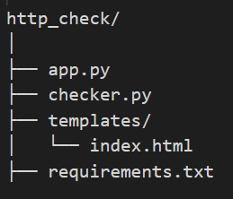

# HTTP Status Checker

A lightweight, production-ready web application built with Flask that enables users to check the availability and status of web endpoints in both single and bulk modes. The tool categorizes HTTP responses, highlights errors, and presents results through a responsive Bootstrap interface, making it ideal for API monitoring, debugging, and basic reconnaissance workflows.

# Features

- __Bulk URL status checking (one URL per line)__

- __Real-time HTTP response validation__

- __Automatic status categorization (Success, Redirection, Client Error, Server Error)__

- __Color-coded results table for quick visual analysis__

- __Clean separation of logic and routing for maintainability__

- __Graceful error handling for invalid URLs and network failures__

# How to Run
#### __1. Clone the repository__

    git clone https://github.com/PYatiM/Appiss.git
    cd Appiss/http_check

#### __2.Install dependencies__

    pip install -r requirements.txt

#### __3. Run locally__

    python run.py
    Visit:
    http://127.0.0.1:5000

# Structure

# Project working and content usage

## 1. Flask Application — app.py
    Purpose:

    Handles HTTP requests

    Passes data to templates

    No business logic inside routes

## 2.Backend Logic — checker.py
    Purpose:

    Handles single & bulk URL checking

    Returns structured results

    Keeps logic separate from Flask

## 3.Frontend UI — templates/index.html (Bootstrap + Bulk Input)
    Features:

    Multi-line URL input

    Color-coded results

    Clean responsive UI